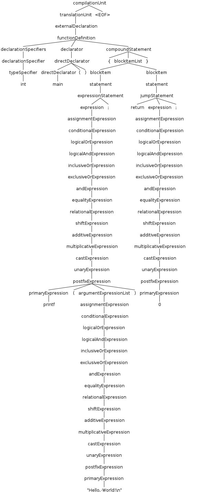
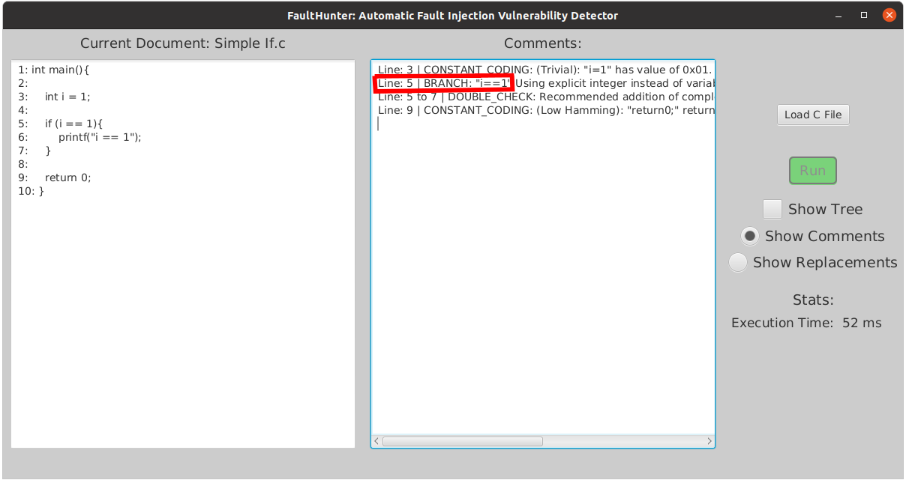
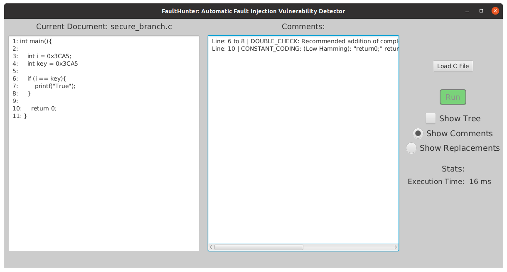
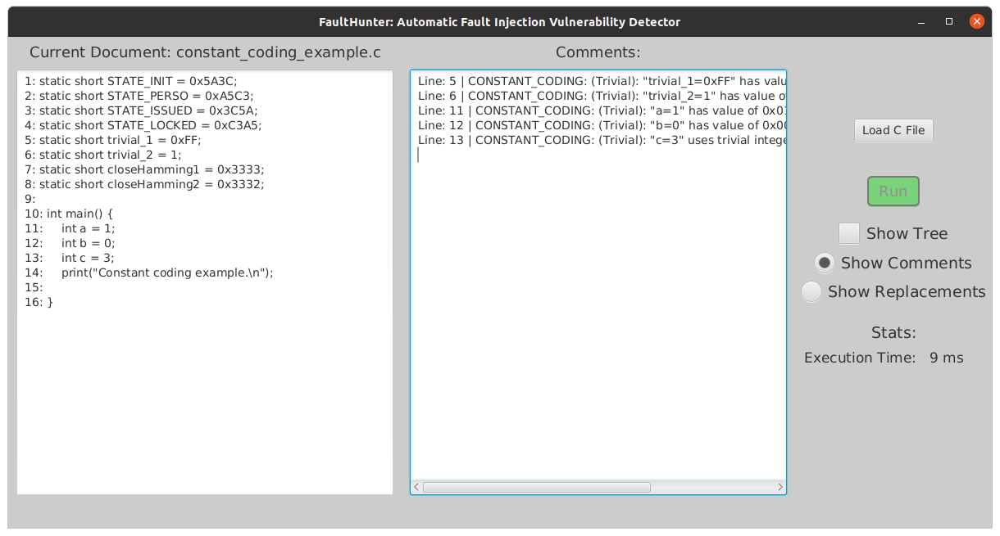
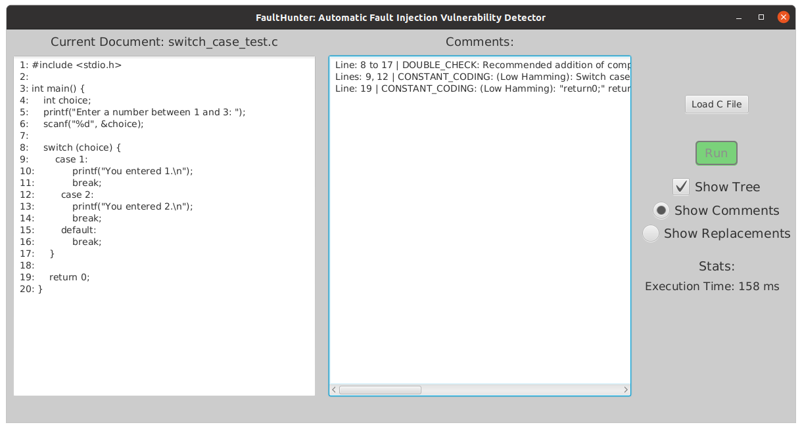
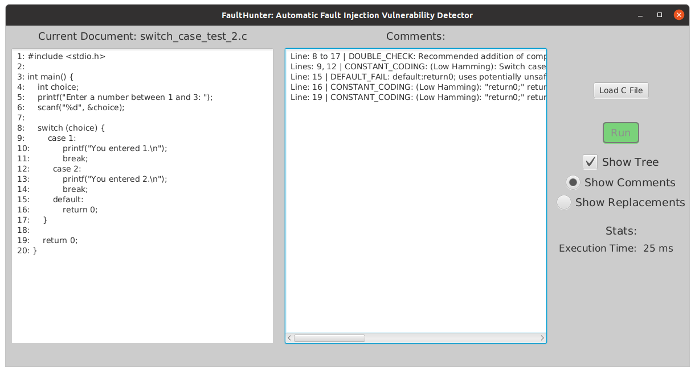
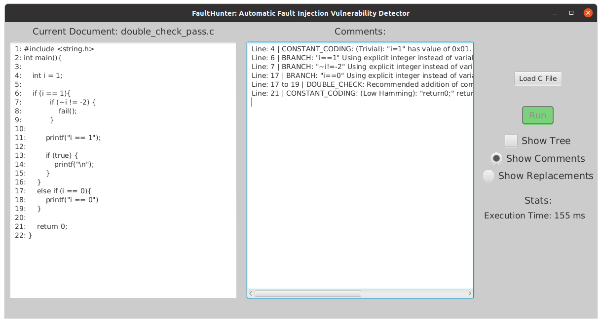
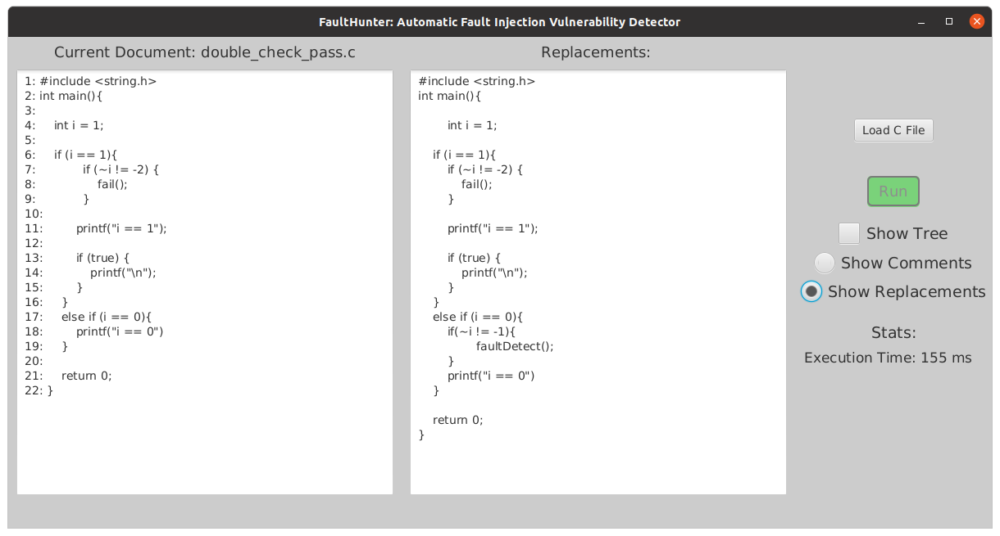
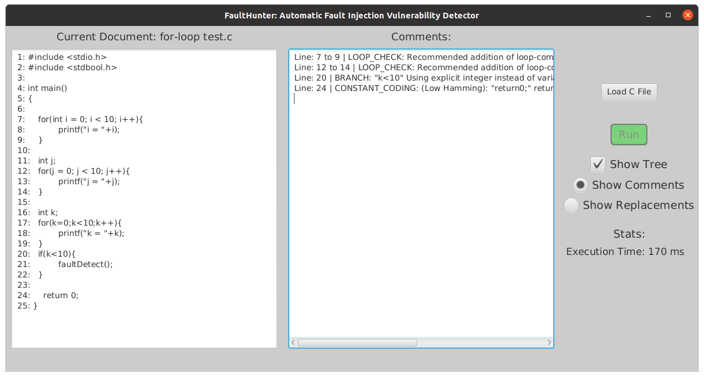
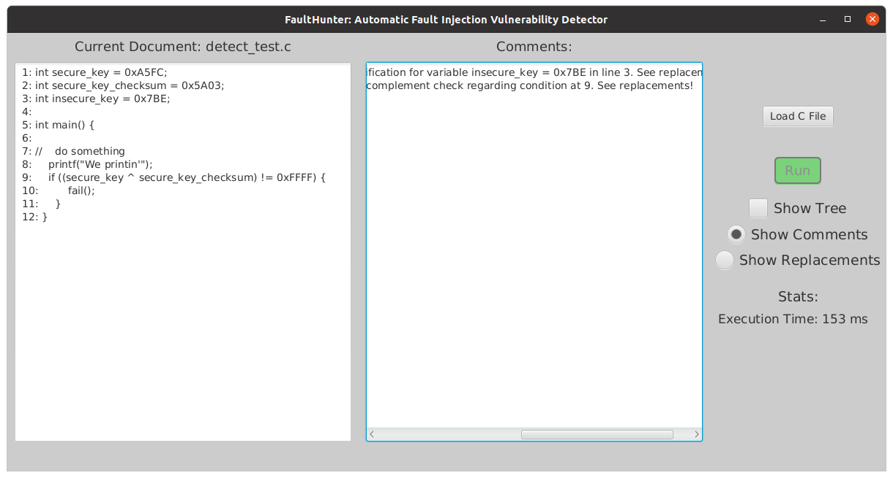

# Coding Patterns and Detection
## Purpose
The purpose of this document is to provide a description of vulnerable coding patterns that are currently detected by the Fault Hunter application. This document will go into the details of how each pattern is detected by Fault Hunter, including examples of successful detection and failed detection. This document will also highlight the current limitations of each detection pattern either because it's a WIP or is deemed out of scope.

## General Mechanism

The general mechanism behind every fault pattern is the use of ANTLR, a program that generates a parse tree of any piece of C code fed into it. Refer to the parse tree generated below for a program that prints "Hello World" for a visualization of the parse tree.

As you can see, each node has a name. This is how we identify the node we want to inspect for a specific fault pattern. ANTLR4 provides a set of functions for each type of node that can be overloaded. This is how we catch hold of a specific node in such a complex parse tree. In our own classes for each pattern, we are able to overload these functions to detect patterns that are vulnerable to fault injection attacks. 

## Table of Contents
| No. | Pattern |
|-----| --------- |
| 1   | Branch |
| 2   | Constant Coding |
| 3   | Default Fail |
| 4   | Double Check |
| 5   | Loop Check |
| 6   | Detect |
| 7 | Bypass |

## 1. Branch

The Branch fault pattern detects boolean values in conditional statements that are vulnerable to fault injection attacks. Generally, simply boolean values like `true`/`false` or `0` or `1` should be avoided and more non-trivial values such as (purely for example) `0x3CA5` and its complement `0xC35A` should be used instead. Moreover, these values must be referred to by a variable, such as `key=0x3CA5`.

For this method, we enter what is either an `EqualityExpression` (for equality, `==` and `!=`) or a `RelationalExpression` (for relations like `>=`, `<=`, `<`, and `>`). These nodes will have at least two nodes and there may be more if connected via an `OR` or an `AND`. Here, we loop through each conditional expression and check whether any of the conditions are simple boolean expressions or use explicit integer values in the comparison.

Below is an example of FaultHunter successfully detecting Branch, and the latter is a case where we do not see a Branch fault pattern, and so as expected, it does not throw a "Branch error".

And the next example is the latter which will not have a Branch error do to the use of safer programming practices.

## 2. Constant Coding

Constant coding is a vulnerable coding pattern where a variable holds a trivial value such as `0`, `1`, or `0xFF`. Moreover, it is important to have a significant hamming distance (*hamming distance is the number of bits that differ between two numbers*). Having a sufficiently large hamming distance ensures that when one bit is flipped or all bits are simultaneously flipped, it does not result in a valid value.

In Fault Hunter, we test for this by checking for an `InitDeclarator`. The If the `InitDeclarator` node has two children node, it means it's an initialization of a variable with a corresponding assigned value. Then, we check value found in an `Initialzer` node to check whether it is trivial or has a low potential hamming distance. Please note, that as of the current writing of this document, we have not detected low hamming distances between two variables in the program.

Consider the following example. **As previously noted, not all constant coding scenarios are covered here**.

## 3. Default Fail

Default Fail is a vulnerable coding pattern that is said to occur when critical code is executed within the `default` clause of a switch case or the `else` clause of an if-else case structure. Since technically any condition that does not meet the previous conditions makes it here, it can be risky to have sensitive code here of any kind as a fault injection could easily trigger these cases. Ideally, they should not exist, but if they do, they should be checked to see if there is any vulnerable code.

To detect a default fail, we look at a node called `LabelledStatement` for default clauses and  `SelectionStatement` for else clauses. Once we have determined that it is indeed a `default` case or `else` case (we can get to know this by looking at the starting string of the statement node), we check to see if the only statement under the clause is a `JumpStatement` of type `return;` (without any parameters) or `break;`. If there is more than one statement or there is any other type of statement, a default fail is triggered.

Consider the two examples below. In the first example, a default fail vulnerability is not detected. This is because there is no sensitive/critical code in the `default` clause of the switch case structure, and in the second, there is a single `return 0;`. While it cannot be said exactly what is sensitive code and what is not, we raise a flag for "potentially" sensitive code whenever any code is detected.

And, the latter where it is detected (because of the `return 0;`)

## 4. Double Check

The lack of a double check in conditional statements is considered vulnerable to fault injection attacks as it may be possible that one such attack was used to force oneself into the condition, where sensitive data may be executed. This is mitigated by the use of a double check, which is the repeated checking of the previous condition's complementary because this will require two different types of fault injection attacks.

In our detection pattern, we look for `SelectionStatement` nodes and we look their respective `EqualityExpression` nodes within. We add the variable name, the value it's being checked against, and the relational operator to three lists. When we are about to exit the `SelectionStatement` that corresponds to the if-case structure we were in, we loop through the lists we had created to see if there are any cases of `if` statements not accompanied immediately by a complement check. If such cases exist, we output this is a comment to the `ResultLine` and we provide replacement code that demonstrates one possible way to conduct a double check.

The following example contains both an example of an if statement with a double check and one without. Notice how it detects a double check for one of them and does not for the other. The second screenshot shows the replacement code that is suggested by Fault Hunter.

## 5. Loop Check

Loop Check is a method to protect against potential fault injection by verifying that all the expected iterations of a loop completed successfully. This is by done having an if statement after the loop verifying that the iterative variable of the loop above has the expected value it should have after the loop completes.

In Fault Hunter, this is verified by first locating the iterative variable. It can either be located within or out of the scope of a `for` loop. After this variable is located, the code after the `for` loop is inspected for an `if` statement that checks for the completion of this loop. If it does, it does not sound a potential loop check vulnerability, or else it does.

Please refer below to an example with three `for` loops. The first and second loop have an if statement to verify the loop's completion and the third does not. Notice how it flags the first two loops but not the first.

## 6. Detect

Detect is a fault protection pattern that checks whether any sensitive variable has been modified by fault injection over the course of execution. It consists of creating a complement of a variable at the beginning during declaration, and then ensuring that a checksum with that complement, possibly before the execution of sensitive code, passes.

Fault Hunter checks for the 'Detect' fault pattern by looking specifically at globally declared variables. The reasoning is that externally declared variables are important since they have a universal scope. So, each global variable, found in the form of an `ExternalDeclaration` node is stored along with its value, and is marked not having a checksum. Since checksums are verified through the use of an `XOR` operation, we look for any `ExclusiveOrExpression` nodes. If the variables in this operation are in the list of global variables we declared earlier, we mark that the variable is found. Finally, we loop through this list and throw an error for every variable that is still declared to not be found in a checksum comparison.

Below is a screenshot of an example where there is a global variable that does have a checksum and one that does not. Notice how `insecure_key` (aptly named) has no checksum verification anywhere in the code, so it throws a `DETECT` error.

## 7. Bypass

The Bypass fault pattern is detected when a fault detection before protected functionality is not done at the same level as the protected functionality such as through a function call. This is because it is possible to skip or manipulate the return value of a function call and enter protected functionality.

For the purposes of Fault Hunter, the way we go about detecting Bypass is by flagging any function call inside an `if` statement. This is because function calls within `if` statements take the condition check outside the scope of the current line to the scope of the function. This means the fault detection check cannot take place at the same level as some protected functioanality, so we flag it as a `BYPASS` fault.

In the example below, `check_palindrome()` is a function that takes an integer and returns a `boolean` value based on whether the integer passed is a palindrome or not. For the purposes of this program, it will serve as the test function that detects faults before any protected functionality. As you can see, there are two instances of fault detection before protected functionality, and the former on `line 22` is flagged as a `BYPASS` fault but the fault check on `line 31` is not.

